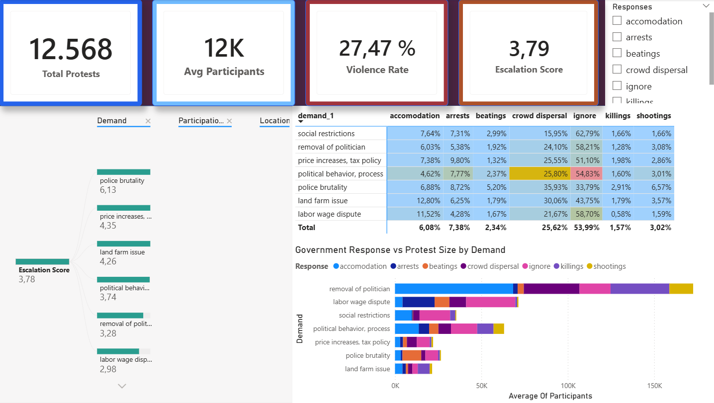
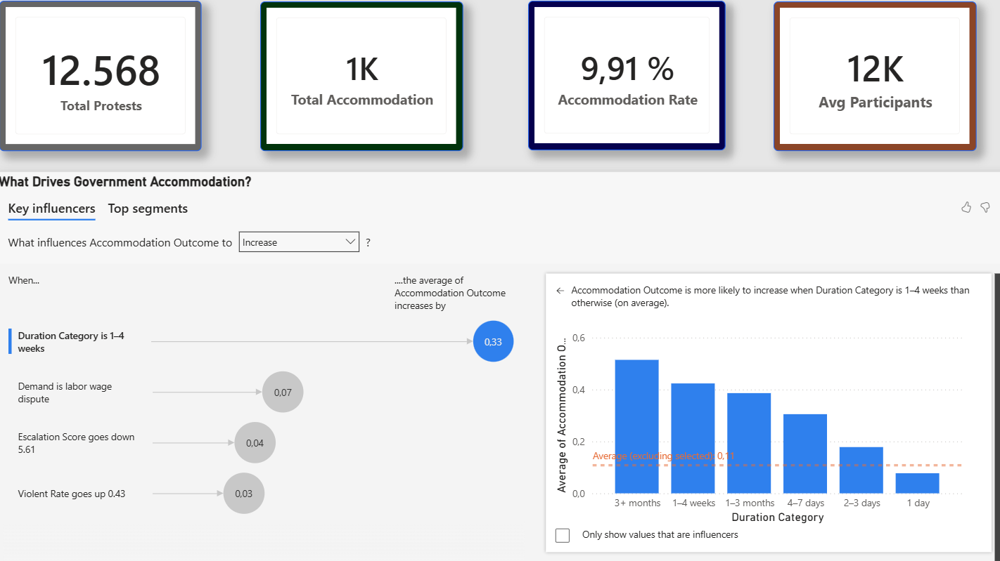

# End-to-End Protest Analysis & Early Warning System (EWS)

## 1. Project Overview

This project is a comprehensive, end-to-end data analysis of global protest events, designed to uncover the drivers of violence and build a predictive **Early Warning System (EWS)** for deadly conflicts. The entire data lifecycle is covered: from raw data ingestion and cleaning, storage in a **PostgreSQL** database, deep statistical analysis and machine learning in **Python**, to the final delivery of insights via an interactive **Power BI Dashboard**.

This is not just a collection of scripts; it's a narrative-driven investigation into a complex real-world problem, showcasing a full spectrum of data science skills.

---

## 2. Key Features & Highlights

*   ✅ **Full Data Pipeline:** Demonstrates the complete workflow from database management (PostgreSQL) to advanced analytics (Python) and business intelligence (Power BI).
*   🧠 **Narrative-Driven Modeling:** The project follows a logical story, asking sequential questions to build a deeper understanding, rather than just building one isolated model.
*   🔧 **Advanced Feature Engineering:** Implemented a custom "Country/Topic Memory" feature to provide historical context to the models, significantly boosting their predictive power.
*   📊 **Interactive BI Dashboard:** The final results are presented in a user-friendly, dynamic dashboard that allows for data exploration and tells a clear story.
*   💻 **Clean & Reproducible Code:** The project is structured logically with clear documentation, allowing others to easily understand and replicate the analysis.

---

## 3. The Analytical Journey: From Questions to Prediction

The project was structured as an investigation, with each step building upon the last:

1.  **The Foundation (Data & EDA):** First, we established a solid base. Raw data was meticulously cleaned, processed, and stored in a PostgreSQL database. Then, using Python (Pandas, Matplotlib, Seaborn), we conducted extensive Exploratory Data Analysis (EDA) to understand the data's shape, find initial correlations, and form our primary hypotheses.

2.  **Question 1: What Drives Protester Violence?** Our first machine learning model was built to answer this. We wanted to understand the triggers that cause peaceful protests to turn violent from the protesters' side.

3.  **Question 2: What Drives State Violence?** The insights from the first model fed directly into our second question. We investigated the factors that lead to a violent response from authorities, discovering a critical feedback loop between the two sides.

4.  **The Final Goal: An Early Warning System (EWS):** With a deep understanding of the dynamics, we built the final model. The EWS is a predictive tool designed to forecast the probability of a protest becoming deadly *before* violence occurs, using only the initial information about the event.

---

## 4. Tech Stack

| Category              | Technologies                                                               |
| --------------------- | -------------------------------------------------------------------------- |
| **Database**          | `PostgreSQL`                                                               |
| **Analysis & ML**     | `Python`, `Jupyter`, `Pandas`, `NumPy`, `Scikit-learn`, `Matplotlib`, `Seaborn` |
| **BI & Visualization**| `Microsoft Power BI`                                                       |

---

## 5. Dashboard Preview

The interactive Power BI dashboard is the culmination of this analysis. It connects directly to the PostgreSQL database and allows users to filter data by region, date, and protest type, providing a powerful tool for exploring the key findings visually.



---

## 6. Project Structure

The repository is organized to be clean and intuitive:

```
.
├── data/
│   └── 127331547554137.xls            # Raw dataset
├── sql/
│   └── FinalProjectSQL.sql            # SQL script for database setup
├── clean Data/
│   ├── Protest_pg_ready.csv            
│   
├── models/
│   ├── ViolenceModel.ipynb     # Model 1
│   ├── RepressionModel.ipynb    # Model 2
│   ├── 04_early_warning.ipynb    # Model 3 (The EWS)
│   └── README.md                     # Technical details of the models
├── powerbi/
│   └── FinalProjectPowerBI.pbix        # Power BI project file
├── requirements.txt                  # List of Python dependencies
└── README.md                         # This main project overview
